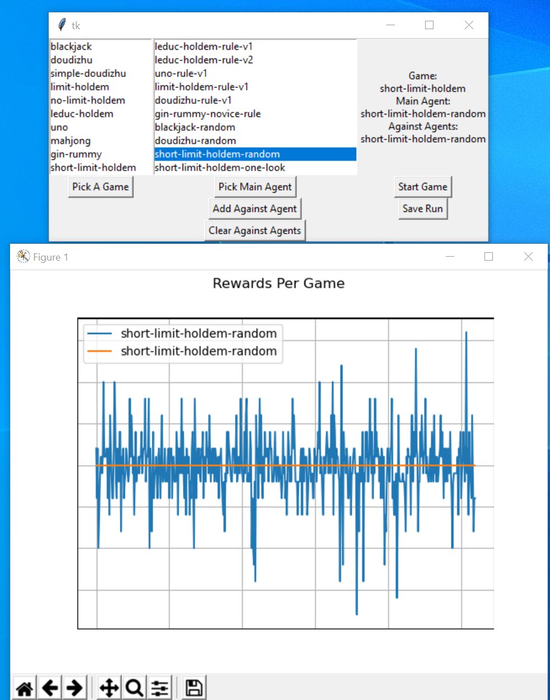

# Auto-Cardshark: Experimental Poker AI for Short-deck Limit Holdem


[](https://travis-ci.org/datamllab/RLCard)
[](https://www.codacy.com/manual/daochenzha/rlcard?utm_source=github.com&amp;utm_medium=referral&amp;utm_content=datamllab/rlcard&amp;utm_campaign=Badge_Grade)
[](https://coveralls.io/github/datamllab/rlcard?branch=master)

This is an experimental learning project by students at Portland State University, using and exapnding the RLCard toolkit to develop and test learning algorthims for a poker game. 
Team members: Johnny Neckar, Jacob Bickle, Joseph Devlin, Yubin Fan, Brandon Altermatt

# New Features
## Short-deck Limit Holdem Implementation
The toolkit has been expanded to include a new poker game, short-deck holdem. Short-deck is a holdem variation which uses a 36 card deck instead of a full 52 card deck. The smaller deck size significantly reduces complexity of the game tree, making it a useful candidate for running experimention on poker games with limited computational resources. In contrast to toy poker games such like Kuhn and Leduc, short-deck retains the strategic depth and complexity of holdem, while still significantly reducing computational cost by shrinking the state-space.

New files: [game folder](/rlcard/games/shortlimitholdem)\
		   [environment file](/rlcard/envs/shortlimitholdem.py)

Edited files: [limitholdem.py](/rlcard/envs/limitholdem.py)


## Graphical Interface for comparaing agents
Running gui.py provides an easy-to-use graphical user interface where you can quickly compare pre-trained models or hueristic based agents against each other. Two graphs show the rewards they earn each game and how much each win on average.

GUI interface: [gui.py](gui.py)



### Launching
```
python gui.py
```
### More information about GUI
See [gui.md](/docs/gui.md)


## Expansion of CFR Algorithm
Counterfactional Regret Minimization is a family of learning algorithms for use in games with imperfect information. Traditional learning algorithms such as Mini-max and Q-Learning are unstable in multiagent games with imperfect information. CFR was the first algorithm to achieve super-human performance in full scale poker games, developing a strategy that is capable of bluffing and deception and robust to opponents which are actively attempting to exploit it. It is however very computationally expensive in large poker games (Cepheus, the agent which developed an approximate solution to 2 player limitholdem, trained for 68 days on 4800 CPUs). Much research has been done on developing modifications and optimizations to the original CFR algorithm. The RLCard toolkit includes an implementation of vanilla-CFR, which the project attempts to expand with some of these improvements.

*need new files*


## Other Rule-based Agents
We developed two rule-based agents except the trained agent by CFR algorithm. One agent follows defensivee rules: At the begining, it raises only if its hand cards have "good" combinations (e.g. pairs, a combination from A to 10). After community cards showed, it searches for the best combo between its hand cards and community cards. If the expected flush or straight or triple does  not exist, it will fold. Another agent follows a simple aggressive rule: it raise anytime whatever its hand cards are. 

File of agents: [shortlimitholdem_rule_models.py](/rlcard/rlcard/models/shortlimitholdem_rule_models.py)\
A simple example to play with the rule-based agents: [short_limit_holdem_human.py](/rlcard/examples/short_limit_holdem_human.py)
A simple statistical that plays more or less agressive based on the cards in their hand: [one_look_agent.py](/rlcard/agents/one_look_agent.py)
A simple statistical that plays more or less agressive based on the cards in their hand: [one_look_agent.py](/rlcard/agents/one_look_agent.py)
Agent trys to figure out if their hand is better or worse than "average": [short_limit_holdem_average_andy.py](/rlcard/agents/short_limit_holdem_average_andy.py)

## Expanded limit holdem and short-limit holdem infoset representation
In order to expand rlcard to meet the various computational needs of training a model, different infoset representations have been created that encode the game's current state for an agent. The goal for these representations is to increase the speed it takes for a model to learn and converge to a strategy, sometimes at the sake of it not performing as well. 

### limit holdem infosets
* default: Improves on the old encoding scheme by packing utilizing suit isomorphisms to vastly lower the overall number of utility scores to calculate. Extremely beneficially for algorithms such as Counterfactual Regret Minimization that traverse all possible states of the game. Details of this scheme can be found [here](https://github.com/jake-bickle/rlcard/issues/11#issuecomment-661328769). Much of the ideas to create this scheme was formulated by this [paper](https://www.cs.cmu.edu/~./kwaugh/publications/isomorphism13.pdf).
* no-hole: Same as default, except any information related to the hole (private) cards are removed
* no-flush: Same as default, except any information related to card suits are removed
* old-encoder: The old encoding scheme.

### short-limit holdem infosets
* These are identical to the limit holdem infosets with the exception that ranks 2-5 are removed.

Tutorials on utilizing the new infoset representations is written below.

New files: \_limitholdem\_infoset\_encoders.py, \_shortlimitholdem\_infoset\_encoders.py
Edited files: limitholdem.py, shortlimitholdem.py


# Installation
Make sure that you have **Python 3.5+** and **pip** to install the requirements. This code is not available on pypi, so you'll have to download from source. The following commands will provide the source code and the requirements to run it.

```
git clone https://github.com/jake-bickle/rlcard.git
cd rlcard
pip install -e .
```

The default installation does not include all available algorithms. Optionally, you may install the supported version of Tensorflow from datamllab's rlcard with:
```
pip install rlcard[tensorflow]
```

To try PyTorch implementations, please run: 
```
pip install rlcard[torch]
```
If you meet any problems when installing PyTorch with the command above, you may follow the instructions on [PyTorch official website](https://pytorch.org/get-started/locally/) to manually install PyTorch.

# Running
The majority of this code is run the same way as datamllab's code. A link to the official tutorial can be found [here] (https://github.com/datamllab/rlcard-tutorial). An addition, there are an ample amount of examples in the `examples` directory, including the file `short_limit_holdem_infoset_representation.py`, to utilize the new features introduced in this fork.

Outside of rlcard-tutorial, datamllab has provided demo code and documentation for utilizing rlcard to its fullest capacity below.


# Support datamllab
*   Official Website: [http://www.rlcard.org](http://www.rlcard.org)
*   Paper: [https://arxiv.org/abs/1910.04376](https://arxiv.org/abs/1910.04376)
*   Resources: [Awesome-Game-AI](https://github.com/datamllab/awesome-game-ai)


## Utilizing new infoset representations
_Note: This feature is only available for limit and short limit holdem environments_

You may describe which agent gets which encoding scheme in the config when creating the game environment. Otherwise, the default encoding scheme is used.
```
import rlcard
from rlcard.agents import LimitholdemHumanAgent as HumanAgent
env = rlcard.make('short-limit-holdem', config={'player_infoset_encoders': ['old-encoder', 'no-flush']})
player1 = HumanAgent(env.action_num)
player2 = HumanAgent(env.action_num)
env.set_agents([player1, player2])
```

## Demo
Run `examples/leduc_holdem_human.py` to play with the pre-trained Leduc Hold'em model. Leduc Hold'em is a simplified version of Texas Hold'em. Rules can be found [here](docs/games.md#leduc-holdem).

```
>> Leduc Hold'em pre-trained model

>> Start a new game!
>> Agent 1 chooses raise

=============== Community Card ===============
┌─────────┐
│░░░░░░░░░│
│░░░░░░░░░│
│░░░░░░░░░│
│░░░░░░░░░│
│░░░░░░░░░│
│░░░░░░░░░│
│░░░░░░░░░│
└─────────┘
===============   Your Hand    ===============
┌─────────┐
│J        │
│         │
│         │
│    ♥    │
│         │
│         │
│        J│
└─────────┘
===============     Chips      ===============
Yours:   +
Agent 1: +++
=========== Actions You Can Choose ===========
0: call, 1: raise, 2: fold

>> You choose action (integer):
```

## Available Environments
We provide a complexity estimation for the games on several aspects. **InfoSet Number:** the number of information sets; **InfoSet Size:** the average number of states in a single information set; **Action Size:** the size of the action space. **Name:** the name that should be passed to `rlcard.make` to create the game environment. We also provide the link to the documentation and the random example.

| Game                                                                                                                                                                                           | InfoSet Number  | InfoSet Size      | Action Size | Name            | Usage                                                                                       |
| :--------------------------------------------------------------------------------------------------------------------------------------------------------------------------------------------: | :-------------: | :---------------: | :---------: | :-------------: | :-----------------------------------------------------------------------------------------: |
| Blackjack ([wiki](https://en.wikipedia.org/wiki/Blackjack), [baike](https://baike.baidu.com/item/21%E7%82%B9/5481683?fr=aladdin))                                                              | 10^3            | 10^1              | 10^0        | blackjack       | [doc](docs/games.md#blackjack), [example](examples/blackjack_random.py)                     |
| Leduc Hold’em ([paper](http://poker.cs.ualberta.ca/publications/UAI05.pdf))                                                                                                                    | 10^2            | 10^2              | 10^0        | leduc-holdem    | [doc](docs/games.md#leduc-holdem), [example](examples/leduc_holdem_random.py)               |
| Limit Texas Hold'em ([wiki](https://en.wikipedia.org/wiki/Texas_hold_%27em), [baike](https://baike.baidu.com/item/%E5%BE%B7%E5%85%8B%E8%90%A8%E6%96%AF%E6%89%91%E5%85%8B/83440?fr=aladdin))    | 10^14           | 10^3              | 10^0        | limit-holdem    | [doc](docs/games.md#limit-texas-holdem), [example](examples/limit_holdem_random.py)         |
| Dou Dizhu ([wiki](https://en.wikipedia.org/wiki/Dou_dizhu), [baike](https://baike.baidu.com/item/%E6%96%97%E5%9C%B0%E4%B8%BB/177997?fr=aladdin))                                               | 10^53 ~ 10^83   | 10^23             | 10^4        | doudizhu        | [doc](docs/games.md#dou-dizhu), [example](examples/doudizhu_random.py)                      |
| Simple Dou Dizhu ([wiki](https://en.wikipedia.org/wiki/Dou_dizhu), [baike](https://baike.baidu.com/item/%E6%96%97%E5%9C%B0%E4%B8%BB/177997?fr=aladdin))                                        | -               | -                 | -           | simple-doudizhu | [doc](docs/games.md#simple-dou-dizhu), [example](examples/simple_doudizhu_random.py)        |
| Mahjong ([wiki](https://en.wikipedia.org/wiki/Competition_Mahjong_scoring_rules), [baike](https://baike.baidu.com/item/%E9%BA%BB%E5%B0%86/215))                                                | 10^121          | 10^48             | 10^2        | mahjong         | [doc](docs/games.md#mahjong), [example](examples/mahjong_random.py)                         | 
| No-limit Texas Hold'em ([wiki](https://en.wikipedia.org/wiki/Texas_hold_%27em), [baike](https://baike.baidu.com/item/%E5%BE%B7%E5%85%8B%E8%90%A8%E6%96%AF%E6%89%91%E5%85%8B/83440?fr=aladdin)) | 10^162          | 10^3              | 10^4        | no-limit-holdem | [doc](docs/games.md#no-limit-texas-holdem), [example](examples/nolimit_holdem_random.py)    |
| UNO ([wiki](https://en.wikipedia.org/wiki/Uno_\(card_game\)), [baike](https://baike.baidu.com/item/UNO%E7%89%8C/2249587))                                                                      |  10^163         | 10^10             | 10^1        | uno             | [doc](docs/games.md#uno), [example](examples/uno_random.py)                                 |
| Gin Rummy ([wiki](https://en.wikipedia.org/wiki/Gin_rummy), [baike](https://baike.baidu.com/item/%E9%87%91%E6%8B%89%E7%B1%B3/3471710))                                                         | 10^52           | -                 | -           | gin-rummy       | [doc](docs/games.md#gin-rummy), [example](examples/gin_rummy_random.py)                     |

## API Cheat Sheet
### How to create an environment
You can use the the following interface to make an environment. You may optionally specify some configurations with a dictionary.
*   **env = rlcard.make(env_id, config={})**: Make an environment. `env_id` is a string of a environment; `config` is a dictionary that specifies some environment configurations, which are as follows.
	*   `seed`: Default `None`. Set a environment local random seed for reproducing the results.
	*   `env_num`: Default `1`. It specifies how many environments running in parallel. If the number is larger than 1, then the tasks will be assigned to multiple processes for acceleration.
	*   `allow_step_back`: Defualt `False`. `True` if allowing `step_back` function to traverse backward in the tree.
	*   `allow_raw_data`: Default `False`. `True` if allowing raw data in the `state`.
	*   `single_agent_mode`: Default `False`. `True` if using single agent mode, i.e., Gym style interface with other players as pretrained/rule models.
	*   `active_player`: Defualt `0`. If `single_agent_mode` is `True`, `active_player` will specify operating on which player in single agent mode.
	*   `record_action`: Default `False`. If `True`, a field of `action_record` will be in the `state` to record the historical actions. This may be used for human-agent play.
	*   Game specific configurations: These fields start with `game_`. Currently, we only support `game_player_num` in Blackjack.

Once the environemnt is made, we can access some information of the game.
*   **env.action_num**: The number of actions.
*   **env.player_num**: The number of players.
*   **env.state_space**: Ther state space of the observations.
*   **env.timestep**: The number of timesteps stepped by the environment.

### What is state in RLCard
State is a Python dictionary. It will always have observation `state['obs']` and legal actions `state['legal_actions']`. If `allow_raw_data` is `True`, state will also have raw observation `state['raw_obs']` and raw legal actions `state['raw_legal_actions']`.

### Basic interfaces
The following interfaces provide a basic usage. It is easy to use but it has assumtions on the agent. The agent must follow [agent template](docs/developping-algorithms.md). 
*   **env.set_agents(agents)**: `agents` is a list of `Agent` object. The length of the list should be equal to the number of the players in the game.
*   **env.run(is_training=False)**: Run a complete game and return trajectories and payoffs. The function can be used after the `set_agents` is called. If `is_training` is `True`, it will use `step` function in the agent to play the game. If `is_training` is `False`, `eval_step` will be called instead.

### Advanced interfaces
For advanced usage, the following interfaces allow flexible operations on the game tree. These interfaces do not make any assumtions on the agent.
*   **env.reset()**: Initialize a game. Return the state and the first player ID.
*   **env.step(action, raw_action=False)**: Take one step in the environment. `action` can be raw action or integer; `raw_action` should be `True` if the action is raw action (string).
*   **env.step_back()**: Available only when `allow_step_back` is `True`. Take one step backward. This can be used for algorithms that operate on the game tree, such as CFR.
*   **env.is_over()**: Return `True` if the current game is over. Otherewise, return `False`.
*   **env.get_player_id()**: Return the Player ID of the current player.
*   **env.get_state(player_id)**: Return the state that corresponds to `player_id`.
*   **env.get_payoffs()**: In the end of the game, return a list of payoffs for all the players.
*   **env.get_perfect_information()**: (Currently only support some of the games) Obtain the perfect information at the current state.

### Running with multiple processes
RLCard now supports acceleration with multiple processes. Simply change `env_num` when making the environment to indicate how many processes would be used. Currenly we only support `run()` function with multiple processes. An example is [DQN on blackjack](docs/toy-examples.md#running-multiple-processes)  

## Library Structure
The purposes of the main modules are listed as below:

*   [/examples](examples): Examples of using RLCard.
*   [/docs](docs): Documentation of RLCard.
*   [/tests](tests): Testing scripts for RLCard.
*   [/rlcard/agents](rlcard/agents): Reinforcement learning algorithms and human agents.
*   [/rlcard/envs](rlcard/envs): Environment wrappers (state representation, action encoding etc.)
*   [/rlcard/games](rlcard/games): Various game engines.
*   [/rlcard/models](rlcard/models): Model zoo including pre-trained models and rule models.

## Evaluation
The perfomance is measured by winning rates through tournaments. Example outputs are as follows:


For your information, there is a nice online evaluation platform [pokerwars](https://github.com/pokerwars) that could be connected with RLCard with some modifications.

## More Documents
For more documentation, please refer to the [Documents](docs/README.md) for general introductions. API documents are available at our [website](http://www.rlcard.org).


## License
This work is released under the MIT License.
Please see the file `LICENSE.md` in this distribution for
license terms.
